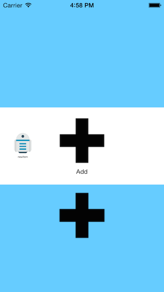

#circleCollectionControl

This control is a collection view with a UICollectionViewFlowLayout subclass.

* There is a scaling effect on items when scrolling.
* The centered item is selected automatically when scrolling ending.
* When you touch an item, it is automatically centered and selected.
* You can decide to show an "add" button.
* A long touch on an item show an alert view asking to delete the item (cannot delete the add button)

Technically this control is a subclass of a UICollectionView with its own constructor. it uses delegation to act with its controller when an item is selected.The circleCollectionView is included in a container view with layout constraint.

## Screenshot

### standard

### Delete Alert view

### Add item

### R2D2 Item added

## Some Ressources

* Many type of Collection views : https://github.com/mpospese/IntroducingCollectionViews

* A nice subclassing of UIcollectionViewLayout : https://github.com/awdigital/AWCollectionViewDialLayout
